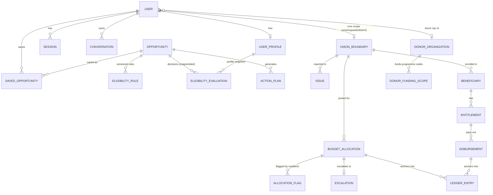
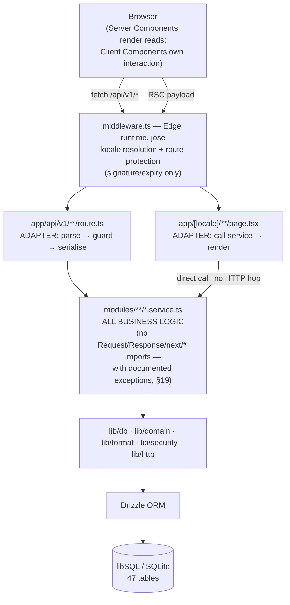

# AccessAI / Shebar Janala — Product & Engineering Handoff

**A knowledge-transfer document for product, design, engineering, and leadership stakeholders.**

This document was produced by reading the running implementation — 47 database tables, ~44 pages,
58 API route files, every design-system CSS token, every UI primitive, and every business-logic
module — not by summarizing existing documentation. Where the codebase's own `docs/*.md` files
were used for orientation, every claim in them was independently re-verified against source files
(cited as `file:line` where useful). Discrepancies found between documentation and code are called
out explicitly, not silently reconciled. Anywhere this document infers a rationale rather than
quoting one found in the code, it is labelled **(inferred)**.

**Repository:** `AccessAI` · **Branch:** `feature/shebar-janala-phase-0-1-2` · **Stack:** Next.js 15
(App Router, React 19, TypeScript strict) · **Data:** libSQL/SQLite via Drizzle ORM · **Deployment
target:** Cloudflare Workers (via OpenNext + Wrangler) · **Date of this audit:** 2026-08-22

---

## How to read this document

The product is really **two layered systems in one codebase**:

1. **AccessAI** — the original product. A bilingual (Bangla/English) benefits-discovery platform:
   a citizen describes their situation, a deterministic rule engine decides what they qualify for,
   and an explanation layer (real AI or a deterministic template composer) tells them why.
2. **Shebar Janala** — a civic-transparency layer built on top of the same app in five phases
   (identity verification → issue reporting → budget ledger/escalation → oversight portals →
   reach channels/compliance). It gives citizens a channel to report problems and see union-level
   budget transparency, and gives officials, donors, and the public verifiable oversight tools.

Every section below treats both halves. Where a section is AccessAI-specific or Shebar-Janala-specific,
it says so.

---

## Table of Contents

1. [Product Overview](#1-product-overview)
2. [Product Mental Model](#2-product-mental-model)
3. [Complete Feature Inventory](#3-complete-feature-inventory)
4. [Screen / Page Inventory](#4-screen--page-inventory)
5. [End-to-End User Flows](#5-end-to-end-user-flows)
6. [Information Architecture](#6-information-architecture)
7. [UX Design Decisions](#7-ux-design-decisions)
8. [Design System](#8-design-system)
9. [Component Library](#9-component-library)
10. [Design Tokens](#10-design-tokens)
11. [Responsive Design](#11-responsive-design)
12. [Accessibility](#12-accessibility)
13. [Interaction & Motion System](#13-interaction--motion-system)
14. [Content & UX Writing](#14-content--ux-writing)
15. [Data & Business Relationships](#15-data--business-relationships)
16. [Technical Architecture](#16-technical-architecture)
17. [Product ↔ Code Mapping](#17-product--code-mapping)
18. [Important Technical/Product Decisions](#18-important-technicalproduct-decisions)
19. [Current Limitations](#19-current-limitations)
20. [Design Debt & UX Debt](#20-design-debt--ux-debt)
21. [What Future Contributors Must Not Break](#21-what-future-contributors-must-not-break)
22. [Presentation-Ready Executive Summary](#22-presentation-ready-executive-summary)

---

## 1. Product Overview

**Product name:** AccessAI (the civic layer is internally called "Shebar Janala" — no separate
public brand exists in the code; it shares AccessAI's login, design system, and database).

**Product purpose:** Help a Bangladeshi citizen — often low-literacy, rural, on a cheap Android
phone and a 2G/3G connection — discover which government and NGO welfare, education, health,
livelihood, and support programmes they qualify for, understand *why* in plain Bangla or English,
and act on it (save, plan, track deadlines). The civic layer additionally lets that same citizen
report a local infrastructure/service problem to their Union Parishad and see, without needing an
account, whether their union's posted budget allocations are being watched by anyone.

**Problem solved:**
- Benefit eligibility rules are scattered across circulars, offices, and word-of-mouth; a citizen
  has no way to check "do I qualify" without visiting an office and asking.
- A benefits chatbot that just asks an LLM "am I eligible" is a liability — it can invent a
  threshold, forget a citation, or state an unverified fact as settled. AccessAI's core bet is that
  the *decision* must never come from a language model.
- Union-level government spending has no citizen-facing transparency or complaint channel in most
  deployments; corruption and unaddressed complaints are hard to escalate or even record.

**Target users:**
| User | What they get |
|---|---|
| Citizen (primary) | Eligibility discovery, application tracking, deadline reminders, nearby offices, issue reporting, entitlement status |
| Union chairman / union staff | Post budget allocations, enrol beneficiaries, record disbursements, see their union's issue feed |
| Upazila officer | Escalation queue for budget allocations flagged by residents |
| Zila (district) officer | Rolled-up oversight across a district's unions |
| Donor organisation representative | Scoped read-only view of programmes they fund |
| Moderator / Administrator (staff) | Content curation, verification, moderation, user/role management, job runs, ledger audit |
| Anyone, no account | Public transparency page; USSD demo simulator |
| A telecom aggregator's server | Real USSD gateway callback (entitlement check, issue filing, by phone number) |

**Core value proposition:**
1. **The decision is never AI-generated.** A deterministic rule engine with three-valued logic
   (`eligible` / `partially_eligible` / `not_eligible` / **`unknown`**) decides eligibility; an AI
   model, when configured, only rewrites an already-fixed set of facts into fluent prose.
2. **Radical honesty about what is real.** Every unverified, simulated, or unconfigured capability
   is labelled in the UI rather than silently faked — "Simulated AI," "unverified sample,"
   "NID: simulated_verified," a disabled voice-OTP button with a stated reason, an SMS demo outbox.
3. **Designed for the hardest client, not the easiest.** 17sp base type, 48–64dp touch targets,
   no placeholder-as-label, OTP digits that never clear on error, Latin numerals by default even in
   the Bangla UI, a hand-rolled 400-line map instead of a 45KB library, server-side voice
   transcription so Firefox and old Android WebViews aren't second-class.
4. **A tamper-evident accountability layer** (Shebar Janala) for union-level budget records and
   staff actions, independently auditable with a script that needs no server and no login.

**Product maturity:** a **working prototype**, explicitly not certified for real deployment. The
deterministic core (eligibility, retrieval, ranking, confidence) is complete and unit-tested. The
knowledge base is **authored sample data** (42 programmes, structured after real Bangladeshi
programmes but with unverified thresholds/amounts). Several external integrations are real code
with no live credentials in this environment (SMS, vision moderation); a few are deliberately not
built at all (OCR, document capture, voice-OTP telephony).

**Current implementation state:** one Next.js 15 modular monolith; 47 database tables; ~44
locale-aware pages; 58 API route files (~90+ handlers); a design system implemented as CSS custom
properties and 17 React primitives; a background-job registry of 6 idempotent jobs; two independent
tamper-evident hash chains (financial ledger, audit log).

### 30-second version

*A citizen tells AccessAI what happened in their life — in Bangla or English, by typing or
speaking. A rule engine (never an AI) decides exactly what they qualify for and shows its reasoning.
The same app also lets citizens report local problems and watch their union's budget, with
tamper-evident records officials and the public can both check.*

### 2-minute version

AccessAI is a bilingual web app for Bangladeshi citizens to find and act on government/NGO benefit
programmes. A citizen's free-text or spoken description ("my husband died, I have three children")
is deterministically parsed for life events and profile facts; those are merged into their profile
without ever overwriting something they deliberately entered. A hybrid retrieval layer (BM25 +
optional embeddings) finds relevant programmes; a rule engine — pure, three-valued, and fully
traced — decides eligibility for each; a ranker weights eligibility, preference match, location,
deadline urgency, popularity, and (currently neutral) similar-user success; and only *then* is an AI
model (Anthropic, OpenAI, or DeepSeek, or a deterministic template composer if none is configured)
asked to turn that fixed set of facts into a reply. The model cannot introduce a programme,
threshold, or citation the deterministic layers didn't already establish — if retrieval finds
nothing, the model is never called at all.

Layered on top (project name internally: "Shebar Janala," phases 0–5) is a civic-accountability
module: citizens verify their identity and union residency, then can report infrastructure/service
issues (with keyword and optional vision moderation), vote on others' reports, and see their union's
posted budget allocations. Flagging enough allocations escalates them to an upazila officer's queue.
Every budget allocation, disbursement, and staff action is written into one of two independent
tamper-evident hash chains, independently auditable via a script that needs no server or login.
Oversight portals exist for union leaders (rolled up to upazila/district), donor organisations
(scoped to what they fund), and the public (a no-login transparency page). A USSD channel and three
real SMS-gateway integrations extend reach to citizens with no smartphone.

### Detailed version

See [Section 3](#3-complete-feature-inventory) onward for the full feature inventory, flows,
architecture, and design system. In one paragraph: the system is a **modular monolith** — one
Next.js app where API route handlers are thin adapters (parse → guard → call one service function →
envelope) and all business logic lives in framework-free service modules (with a few documented
exceptions, see [§19](#19-current-limitations)). The conversation pipeline's ordering is the single
most important architectural fact: NLU → profile update → retrieval → rule engine → ranking →
`ResponsePlan` (a fixed, enumerated set of facts) → render (model or composer) → persist. Everything
downstream of the `ResponsePlan` is a rendering concern; everything upstream is a decision. The
Shebar Janala layer reuses the same session/RBAC/design-system infrastructure but introduces a
second, orthogonal authorization axis — **civic roles**, scoped by title *and* place, never by rank
alone — and a hash-chain primitive used independently for financial records and for the staff audit
log.

---

## 2. Product Mental Model

**Main entities** (see [§15](#15-data--business-relationships) for the full relationship map):
`User` (with a `Profile`), `Opportunity` (a benefit programme, with an `EligibilityRule`),
`Conversation`/`Message`, `EligibilityEvaluation` (a decision, snapshotted), `SavedOpportunity`,
`ActionPlan`/`Task`, `TimelineEvent`, `Notification` — and, in the civic layer, `UnionBoundary`,
`Issue`, `BudgetAllocation`, `Escalation`, `Beneficiary`/`Entitlement`/`Disbursement`,
`LedgerEntry`, `DonorOrganization`.

**Main workflows:**
- *Discover → Decide → Act*: a citizen describes a situation, gets a ranked, explained set of
  programmes, saves one, generates an action plan from its real application steps, and tracks
  deadlines.
- *Report → Moderate → Resolve*: a citizen reports a civic issue, it's screened and possibly
  flagged, a moderator verifies or rejects it, staff move it through a fixed lifecycle to resolution.
- *Allocate → Flag → Escalate → Resolve*: an official posts a budget allocation, residents flag it,
  crossing a flag-ratio threshold escalates it to an upazila officer, who resolves or dismisses it.
- *Enrol → Disburse → Verify*: an official enrols a beneficiary and records disbursements; the
  citizen (or a USSD caller) checks their own status by NID; auditors verify the whole ledger.

**User → Action → Business Process → State Change → Result** (concretely, for the two flagship
flows):

```
Citizen types/speaks a situation
   → NLU extracts life events + profile facts (deterministic)
   → Profile updated (never overwrites a deliberate entry)
   → Retrieval finds candidate programmes (BM25 [+ embeddings])
   → Rule engine evaluates each programme (three-valued, fully traced)
   → Ranker orders by eligibility/preference/location/deadline/popularity
   → ResponsePlan fixes every fact the reply may state
   → Model or composer renders prose
   → Message + ai_log + one eligibility_evaluation per programme persisted
   = Result: an explained, cited, saveable recommendation
```

```
Resident flags a budget allocation
   → allocationFlags row inserted (idempotent per resident)
   → flagCount incremented on the allocation
   → shouldEscalate() checks flagCount ≥ 2 AND ratio ≥ 50% of verified residents
   → if true and not already escalated: escalations row created, upazila officer resolved
     by union → upazila lookup (or left unassigned, never dropped)
   → notification sent to the officer if one exists
   = Result: a queue item an officer can acknowledge/resolve/dismiss, or a visible
     "unassigned" gap an administrator can close
```



```mermaid
flowchart TD
    subgraph Benefits["AccessAI — benefits discovery"]
      A[Citizen] -->|describes situation| B[NLU: locale, intent,\nlife events, entities]
      B --> C[Profile update\nsetIfAbsent only]
      C --> D[Retrieval\nBM25 + metadata filter]
      D --> E[Rule engine\nthree-valued, traced]
      E --> F[Ranker\n40/15/15/10/10/10]
      F --> G[ResponsePlan\nfacts fixed]
      G --> H{AI configured?}
      H -->|yes| I[Live model renders prose]
      H -->|no / fails| J[Deterministic composer]
      I --> K[Persist message + ai_log +\neligibility_evaluation]
      J --> K
      K --> L[Citizen: save, plan, track]
    end

    subgraph Civic["Shebar Janala — accountability"]
      M[Resident] -->|verifies identity + union| N[Residency-gated features unlock]
      N --> O[Report issue] --> P[Moderation + state machine]
      N --> Q[View/flag budget allocation]
      Q --> R{Escalation threshold met?}
      R -->|yes| S[Upazila officer queue]
      R -->|no| Q
      T[Union official] --> U[Post allocation / enrol beneficiary /\nrecord disbursement]
      U --> V[(Hash-chained ledger)]
      S --> V
      V --> W[Leader / Donor / Public\ntransparency portals]
    end
```

**Product hierarchy:** platform role (guest→citizen→moderator→administrator→super_admin, a strict
rank) is orthogonal to **civic role** (none→union_staff→union_chairman→upazila_officer→zila_officer,
scoped by *place*, never authorising by rank alone) and to a **donor** flag (`donorOrgId`, not a
role at all). A single user account can be a citizen *and* hold a civic role *and* be a donor
representative simultaneously — the three axes compose rather than replace each other.

---

## 3. Complete Feature Inventory

Organized **Domain → Module → Feature**, with status verified against code (not assumed from
filenames or docs). Status legend: **Live** = fully implemented and reachable; **Live (sample
data)** = fully implemented, operating on authored/unverified content; **Live (unexercised)** =
real code, never run against a live external credential in this environment; **Simulated** = a
labelled stand-in for a real integration; **Not built** = does not exist.

### A. Benefits Discovery & Eligibility (AccessAI core)

| Feature | Description | User | Status | Screens | Backend | Notes |
|---|---|---|---|---|---|---|
| Life-event landing grid | Browse by "what happened to you" (15 life events) with no login | Citizen, anonymous | Live | `/` | `GET /life-events` | Powers the unauthenticated entry point |
| Programme browser | Filter/search/sort 42 programmes by category, outcome, life event, district, text | Citizen, anonymous | Live | `/opportunities` | `GET /opportunities` | Personalises eligibility outcome per row if signed in |
| Programme detail + Trust Dashboard | Full eligibility trace, confidence breakdown, sources, required docs, nearby offices | Citizen, anonymous | Live | `/opportunities/[slug]` | `GET /opportunities/:slug` | Shows per-condition trace, not just a verdict |
| Eligibility check ("what-if") | Evaluate against stored profile or hypothetical overrides, never persisted | Citizen | Live | detail page | `POST /eligibility/check` | Overrides layer over profile for one evaluation only |
| Deterministic rule engine | Three-valued (`eligible`/`partially_eligible`/`not_eligible`/`unknown`) evaluation, no LLM, fully traced, 13 comparators | System | Live | n/a | `modules/eligibility/engine.ts` | 28 unit tests; hard bars short-circuit before "unknown" |
| Hybrid retrieval | Metadata pre-filter + BM25 + optional cosine/RRF fusion over 158 bilingual chunks | System | Live | n/a | `modules/knowledge/retrieval.ts` | Semantic channel contributes nothing (not faked) without an embedding key |
| Recommendation ranking | Weighted 40% eligibility / 15% preference / 15% location / 10% deadline / 10% popularity / 10% similar-user (neutral) | System | Live | opportunities list, chat | `modules/recommendation/ranker.ts` | Outcome band always outranks weighted score |
| Knowledge base trust states | `unverified_sample → pending_review → verified`, plus `outdated`/`disputed`, each with a confidence ceiling | Staff, citizen (visible) | Live (sample data) | badges everywhere | `verification_status` columns | 65% ceiling on unverified content, shown as the first reason |
| Confidence scoring | 5-factor weighted score (retrieval 25% / rule completeness 30% / sources 15% / freshness 15% / metadata 15%) with hard ceilings | Citizen (visible) | Live | chat, detail page | `modules/ai/confidence.ts` | Never overstates; ceiling explanation surfaces first |

### B. Conversational AI Assistant

| Feature | Description | Status | Notes |
|---|---|---|---|
| Bilingual chat (bn/en) | Free-text or spoken description → grounded recommendation | Live | Deterministic NLU, not the model, does the understanding |
| Deterministic NLU | Script-based locale detection, 10/13-intent classification, 15 life events, 15 profile-field entity extraction | Live | No model call; Banglish handled as Latin-script English-keyword overlap, not a distinct phonetic layer |
| Grounded response rendering | Live model (Anthropic/OpenAI/DeepSeek) or deterministic composer render the *same* fixed `ResponsePlan` | Live / Live (honest fallback) | Model cannot introduce facts the plan didn't enumerate |
| "Simulated AI" honesty banner | Explicit UI notice whenever the engine is simulated or degraded | Live | States decisions are identical, only prose fluency differs |
| Conversation history | List/reopen/delete past conversations | Live | Ownership enforced by query (404, not 403, on someone else's) |
| Feedback / correction | Thumbs up/down, "report incorrect," lands in moderation queue | Live | Never auto-edits a rule; a human always decides |
| Grounding-failure tracking | `ai_logs.groundingFailure` flags any recommendation with zero citations | Live | Queryable, not just hoped-absent |
| Ask-before-recommend | If nothing has a decided outcome yet and a field is missing, ask one targeted question instead of guessing | Live | `chooseMissingField()` picks the highest-leverage field |

### C. Citizen Journey Management

| Feature | Description | Status | Notes |
|---|---|---|---|
| Save / tracker board | Save a programme, move it through 8 statuses (`interested…completed`), idempotent | Live | Status history recorded |
| Action plans | Auto-generated task list from a programme's *own* application steps + required documents | Live | Deterministic; deadline-compression pass if naive schedule overruns |
| Timeline / deadline calendar | Agenda + month view, deadlines/renewals/reminders, reconciled inline on open | Live | Never model-generated dates |
| Notifications | In-app inbox, 7 types, per-channel preference (in-app/push/email/sms) | Live | "Mark all read" is a separate explicit action, never automatic |
| Profile editor | 34-field eligibility profile, every field optional, health data behind explicit consent | Live | `shareHealthData` gates persistence and encryption of `medicalConditions` |
| Settings | Theme (incl. sunlight), text scale (4 steps), numerals, reduce-motion, notification channels, sessions, data export, account deletion | Live | Delete requires typing "DELETE" verbatim |

### D. Nearby Services & Maps

| Feature | Description | Status | Notes |
|---|---|---|---|
| Nearby Services list | Seeded corpus (327 locations) + live OpenStreetMap places, clearly badged separately | Live | Sample addresses invented but structurally honest; only real national helplines are dialable |
| Hand-rolled map | Custom Mercator projection, no map library, fully keyboard-operable, tile-proxied | Live | Avoids ~45KB Leaflet on a 2G target |
| Distance from real position | Uses actual GPS fix when shared, states which reference point it used | Live | Earlier version silently snapped to district centroid — fixed |
| District/type filters | Filter by 17 location types and district | Live | Category caps at 6 per type when unfiltered (banks vs hospitals imbalance) |

### E. Identity & Access

| Feature | Description | Status | Notes |
|---|---|---|---|
| Registration / login / PIN reset | Phone + OTP + 4–6 digit PIN | Live | No email/password, no CAPTCHA, no Google OAuth (BDS-driven deviation) |
| Session management | Access/refresh JWT hybrid, rotation with reuse detection, session list, sign-out-everywhere | Live | See [§16](#16-technical-architecture) |
| PIN lockout | Flat 10-minute self-clearing lock after 5 wrong attempts | Live | Not truly "progressive delay" despite docs' phrasing — see [§19](#19-current-limitations) |
| NID verification | Format-check + hash, labelled `simulated_verified` (no live government API) | Simulated | Never silently claims real verification |
| Residency (union) verification | GPS point-in-polygon against 5 seeded union boundaries, or manual union pick | Live (sample geometry) | Manual path recorded as weaker evidence (`manual_attestation`) |
| Voice OTP | Fallback for citizens who can't read the SMS | Not built | Button visible, disabled with a stated reason |
| Data export | Citizen-triggered JSON download of their own data | Live | Assembled client-side from already-authorized reads |
| Account deletion | Full hard delete | Live | Audit rows keep the action with actor nulled, not deleted |

### F. Voice & Reach Channels

| Feature | Description | Status | Notes |
|---|---|---|---|
| Voice navigation (commands) | Deterministic phrase matching, works with zero keys, ~1ms | Live | Offline, no model involved |
| Voice dictation (fields) | Speak digits into phone/OTP fields; never PIN fields; never auto-submits | Live | Exact digit count or reject; verbatim transcript shown on mishearing |
| Speech-to-text | Groq / self-hosted whisper.cpp / OpenAI, OpenAI-compatible `/audio/transcriptions` | Live (unexercised in this env) | No simulated transcriber exists — "you cannot fake hearing" |
| Read-aloud (TTS) | Server synthesis preferred over device `speechSynthesis` (Android often lacks a bn-BD voice) | Live (unexercised) | ETag-cached; verified 304 on repeat |
| SMS OTP delivery | Real SSL Wireless / BulkSMSBD / Twilio adapters, or a demo mode | Live (unexercised) / Simulated | Dev echo prints code to console+UI when no provider configured |
| USSD gateway | Real telecom-aggregator callback contract (`CON`/`END`, shared-secret auth) | Live (unexercised) | Entitlement check by NID, issue filing (verified residents only), list own reports |
| USSD in-browser simulator | Drives the identical service logic as the real callback, for demos | Live | `/ussd-demo`, `POST /api/v1/ussd/simulate` |

### G. Civic Reporting (Shebar Janala Phase 1–2)

| Feature | Description | Status | Notes |
|---|---|---|---|
| Issue reporting | Category, title, description, photo, mandatory GPS location | Live | Scoped to the reporter's own verified union |
| Keyword moderation | Deterministic spam/abuse keyword + length-floor screen | Live | Flags for review, never auto-rejects |
| Vision moderation of photos | Real vision-model call, `demo` size-heuristic, or `unavailable` (auto-flag) | Live (unexercised) / Simulated | No fabricated pass/fail when unconfigured |
| Photo storage | Cloudflare R2/S3-compatible writer when configured, local filesystem fallback | Live | **Ahead of `docs/DEVIATIONS.md` §16**, which still says "no object-storage writer" — see [§19](#19-current-limitations) |
| Issue state machine | Fixed lifecycle `submitted→under_review→(verified|rejected)→in_progress→completed→archived` | Live | Enforced in code, not just documented |
| Voting/endorsement | One toggleable vote per resident per issue | Live | Union-scoped |

### H. Budget Transparency & Accountability (Shebar Janala Phase 3)

| Feature | Description | Status | Notes |
|---|---|---|---|
| Budget allocation posting | Union chairman/staff posts a project + amount + date | Live | Ledger-anchored on write |
| Citizen flagging | One flag per resident per allocation | Live | |
| Escalation | Fires once, when flagCount ≥ 2 **and** flag ratio ≥ 50% of verified residents | Live | Never re-notifies on a rising ratio afterward |
| Beneficiary enrolment | Real UI (not just API) for enrolling a beneficiary by NID hash | Live | `/beneficiaries/new` |
| Disbursement recording | Real UI for recording a payment against an entitlement | Live | Ledger-anchored |
| Entitlement status check | "What am I actually enrolled in / paid," matched by verified NID hash — distinct from eligibility discovery | Live | Also reachable via USSD with no account |
| Tamper-evident hash chain (ledger) | Every allocation/disbursement chained; independently verifiable | Live | `npm run ledger:audit` needs no server/login |
| Tamper-evident hash chain (audit log) | Every staff/system action chained, including login/logout | Live | One confirmed live gap — see [§19](#19-current-limitations) |

### I. Oversight Portals (Shebar Janala Phase 4)

| Feature | Description | Status | Notes |
|---|---|---|---|
| Leader Portal | Chairman/staff (own union) or upazila/zila officer (rolled-up) view of allocations, issues, beneficiaries, anomalies | Live | Same code path for single-union and multi-union rollup |
| Anomaly detection | 5 deterministic checks: allocation outlier (>3× median), duplicate beneficiary enrolment, unverified ("ghost") beneficiary, overpaid disbursement, stale escalation (>14 days) | Live | Docs undercount this as "four" — see [§19](#19-current-limitations) |
| Donor Portal | Read-only, strictly scoped to a donor's funded programme codes | Live | Verified: a donor scoped to one programme sees only that programme's numbers |
| Public transparency page | No-login aggregate view: union names, allocation totals, programme-level disbursement totals, live ledger-integrity check, elected officials' names | Live | Deliberately excludes any citizen identity, even aggregated |
| Escalation queue | Upazila officer's own + unassigned pool; acknowledge/claim/resolve/dismiss | Live | Unassigned escalations stay visible, never silently dropped |

### J. Reach & Compliance (Shebar Janala Phase 5)

| Feature | Description | Status | Notes |
|---|---|---|---|
| Field-level encryption | AES-256-GCM on `medicalConditions` at rest | Live | `district`/`upazila`/`phone` deliberately deferred, reasons documented |
| Data retention job | Deletes conversations >730d, AI logs >365d, expired OTPs >7d | Live | Never touches ledger or audit log, by design |
| Compliance self-assessment | Union Parishads Act 2009 mapping | Live (self-assessment, not certification) | Explicitly not a legal review |
| SMS demo outbox | Staff-visible record of everything a `demo` SMS provider "sent" | Live | Never claims a real message arrived |

### K. Administrative / Governance Console

| Feature | Description | Status | Notes |
|---|---|---|---|
| Programme & organisation CRUD | Create/edit programmes and organisations; never born verified | Live | Content edits revoke prior verification |
| Verification workflow | Only an administrator can verify; verify-and-edit in one request is refused (422) | Live | Anti-self-certification, tested |
| Rule publishing + smoke test | New rule versions only; deactivates the prior version; warns on "unsatisfiable" / "too permissive" / missing `requiredFields` | Live | Rule editor UI is deliberately read-only |
| Moderation queue | Feedback, knowledge-change reviews, pending issues, grounding failures in one screen | Live | |
| AI logs | Per-response engine/provider/model/tokens/latency/citations/confidence/groundingFailure | Live | Privacy-conscious: 500-char summaries only |
| User & role management | Change platform role/status, civic role/scope, donor org | Live | Cannot self-edit; cannot act on rank ≥ own rank; demotion revokes all sessions |
| Civic role & donor-org assignment | Assign union/upazila/district civic titles; manage donor orgs and funding scopes | Live | |
| Background jobs | 6 idempotent jobs, runnable from the UI or any external scheduler | Live | Docs say "five" — see [§19](#19-current-limitations) |
| Ledger integrity (internal) | Staff-facing hash-chain verification, distinct from the public page | Live | |

---

## 4. Screen / Page Inventory

All routes exist under both `/bn/...` and `/en/...`. Guard levels: **None** = works signed out;
**Session** = any signed-in account; **Staff** = moderator/administrator/super_admin; **Civic-role**
/ **Donor** = a specific scope check, never a bare role check.

### Public (no auth, outside the authenticated shell)

| Screen | Route | Purpose | Key states |
|---|---|---|---|
| Landing | `/[locale]` | Life-event/category grid, entry point | — |
| Login | `/[locale]/login` | Phone+PIN or phone+OTP sign-in | Account-locked banner offers OTP escape hatch |
| Register | `/[locale]/register` | OTP + name/PIN/language | — |
| Forgot PIN | `/[locale]/forgot-pin` | OTP-verified PIN reset | — |
| Public transparency | `/[locale]/transparency` | SJ-37 no-login civic accountability page | Ledger intact/broken banner |
| USSD simulator | `/[locale]/ussd-demo` | In-browser feature-phone demo | — |
| 404 / error boundary | `not-found.tsx` / `error.tsx` | Global fallbacks | Never shows a raw stack trace |

### Authenticated — citizen core

| Screen | Route | Purpose |
|---|---|---|
| Dashboard | `/dashboard` | Decision-ordered home: today's tasks → deadlines → recommendations → saved → issues → recent chat |
| Chat | `/chat` | AI assistant, server-loaded transcript |
| Opportunity browser | `/opportunities` | Filterable/searchable programme list |
| Opportunity detail | `/opportunities/[slug]` | Eligibility trace + Trust Dashboard |
| Saved / tracker | `/saved` | Tracker board + action plans |
| Timeline | `/timeline` | Deadline calendar |
| Nearby | `/nearby` | Map + service list |
| Profile | `/profile` | Eligibility-profile editor |
| Settings | `/settings` | Preferences, notifications, sessions, privacy |
| Notifications | `/notifications` | Inbox |
| Entitlements | `/entitlements` | "What am I enrolled in / paid" (distinct from eligibility) |
| Identity | `/identity` | NID + residency verification |

### Authenticated — civic reporting & budget (union-scoped)

| Screen | Route | Guard |
|---|---|---|
| Issue feed / my reports | `/issues` | Session + verified `residencyUnionId` |
| Report an issue | `/issues/new` | Session + verified residency |
| Issue detail | `/issues/[id]` | Session |
| Budget feed | `/budget` | Session + verified residency |
| Post allocation | `/budget/new` | Union official only |
| Allocation detail | `/budget/[id]` | Session |
| Beneficiary roll | `/beneficiaries` | Union official only |
| Enrol beneficiary | `/beneficiaries/new` | Union official only |
| Beneficiary detail | `/beneficiaries/[id]` | That union's official only |

### Civic leadership / oversight

| Screen | Route | Guard |
|---|---|---|
| Leader Portal | `/leader` | Civic role (chairman/staff/upazila/zila officer) |
| Escalation queue | `/officer` | `civicRole === 'upazila_officer'` |
| Donor Portal | `/donor` | `donorOrgId` set |

### Admin / staff console (all `Staff`; several actions additionally gated `administrator`)

| Screen | Route |
|---|---|
| Overview | `/admin` |
| Programmes | `/admin/programmes` |
| Rules (read-only inspector) | `/admin/rules` |
| Organisations | `/admin/organisations` |
| Moderation queue | `/admin/moderation` |
| AI logs | `/admin/ai-logs` |
| Users | `/admin/users` |
| Civic roles & donor orgs | `/admin/civic-roles` |
| Ledger integrity | `/admin/ledger` |
| SMS demo outbox | `/admin/sms-outbox` |

There is **no dedicated data-retention screen** — retention runs only as a job from `/admin`'s job
runner.

---

## 5. End-to-End User Flows

### 5.1 Benefits discovery via chat (happy path)

1. Citizen signs in, opens **Chat**, types or speaks a situation.
2. NLU detects locale, life event(s), and extractable profile fields; profile updated (only fields
   not already deliberately set).
3. Retrieval finds candidate programmes; rule engine evaluates each; ranker orders them.
4. If at least one has a decided outcome, a `ResponsePlan` of recommendations is built; otherwise, if
   a single missing field would resolve the most unknowns, a clarifying question is asked instead.
5. A live model (if configured) or the deterministic composer renders the plan; the reply always
   ends with a next step and, for recommendations, citations.
6. Citizen saves a programme from the reply.

**Exception paths:** retrieval returns nothing → plan says so, model is *never called* (no
hallucination surface). Model call errors or exceeds its abort timeout → falls back to the composer,
tags the message `degraded: true`, tells the citizen honestly. Citizen's free text is a greeting or
clearly out of scope → short-circuits to a canned response with no retrieval/engine call at all.

### 5.2 Registration / login / PIN lockout

1. Citizen enters phone → requests OTP (`purpose=register`); with `OTP_DEV_ECHO` on, the code is
   shown labelled "development only"; otherwise sent via the configured SMS provider or the request
   fails loudly if none is configured.
2. Enters code + name + PIN → account created, phone marked verified, session issued.
3. **Wrong-PIN path:** up to 5 attempts; on the 5th, a flat 10-minute self-clearing lock (not an
   increasing per-attempt delay, despite "progressive delay" language elsewhere — see [§19](#19-current-limitations)).
   The locked screen offers "sign in with a code instead" rather than a dead end.
4. **Stolen refresh token:** presenting an already-rotated refresh token revokes every active session
   for that user and forces a fresh sign-in everywhere — unless it happens within a 20-second grace
   window of a legitimate concurrent rotation, in which case it's treated as a benign race, not theft.

### 5.3 Identity verification → issue reporting (Shebar Janala)

1. Citizen opens **Identity**, submits an NID number → format-checked, hashed, marked
   `simulated_verified` (never `verified`, since no live government API is wired in).
2. Submits residency: shares GPS → point-in-polygon test against the 5 seeded union boundaries; a
   match records `gps_geofence`. No match (the common case at this seed-corpus scale) → falls back
   to picking a union from a list, recorded as the weaker `manual_attestation`.
3. With `residencyUnionId` set, **Issues** and **Budget** unlock. Without it, both show a plain
   "verify your union first" state rather than an empty feed that looks broken.
4. Citizen reports an issue with mandatory GPS + optional photo. Text is keyword-screened; a photo is
   vision-moderated (real check, demo heuristic, or `unavailable`+auto-flag). Status starts
   `under_review`; a moderator later verifies or rejects it; staff then move it through
   `in_progress → completed → archived`.

### 5.4 Budget flag → escalation → officer resolution

1. Union official posts an allocation → ledger-anchored immediately.
2. Verified residents flag it if concerned; each flag is idempotent per resident.
3. Once flagCount ≥ 2 **and** the flag ratio reaches 50% of verified residents in that union, an
   `escalations` row is created — resolved to the union's upazila officer if one is assigned, or left
   **visibly unassigned** (never silently dropped) if not.
4. The officer acknowledges, then resolves or dismisses from their queue; escalation fires only once
   per allocation — a rising ratio afterward does not re-notify.

### 5.5 Beneficiary enrolment → disbursement → status check

1. Union official enrols a beneficiary by NID (hashed, optionally linked to an existing account) and
   creates an entitlement.
2. Official records a disbursement against that entitlement → ledger-anchored.
3. The citizen (via `/entitlements`, if their own NID is verified) or **anyone via USSD** (no account
   needed) checks status by NID hash — the same `buildStatusResult()` function answers both paths, so
   they can never silently drift apart.

### 5.6 Admin: verify a programme

1. A moderator authors or edits a programme → always lands `draft` + `unverified_sample`, never
   self-certified.
2. An administrator reviews the source, then submits **only** `verificationStatus: 'verified'` in a
   request with no other field changed — a request that mixes a content edit with verification is
   refused with 422 ("verify in a separate step").
3. The same query's confidence ceiling visibly moves from 65% to a number the other four factors
   actually earn.

---

## 6. Information Architecture

**Primary navigation** (5 items max, both mobile bottom-nav and desktop sidebar top): Home, Chat,
Opportunities, Timeline, Saved. **Secondary navigation** (sidebar only, below a divider): Nearby,
Issues, Budget, Entitlements, Identity, Notifications, Profile, Settings — plus **role-conditional**
links that only render for the roles that can use them: Officer, Leader, Beneficiaries, Donor, Admin.

There is **no hamburger menu anywhere** (a stated design-system prohibition — "a first-time user
does not recognise it, and it hides the entire information architecture behind a glyph"). The
**admin console** uses a horizontal scrolling tab bar rather than a second sidebar, to stay within a
stated three-level navigation-depth maximum.

**Navigation is organized primarily around business tasks and secondarily around role**: the
citizen-facing primary nav is task/workflow-stage oriented (ask → browse → track → save), while civic
and admin functionality is gated entirely by identity (role or civic scope) rather than being
exposed and then permission-checked — a link a user cannot use simply does not render.

**Breadcrumbs** are not used anywhere in the app (flat, shallow hierarchy by design — most content
is one or two levels deep from a primary nav item). **Search** exists at the programme-browser level
(text query + filter chips) and inside searchable Select sheets (16+ option lists). **Filters**
compose via repeatable query parameters and persist in the URL, making filtered views shareable and
back-button-safe.

---

## 7. UX Design Decisions

Each pattern: **what was done → why it matters → where it appears.** Rationale is quoted from
in-code design-rationale comments where available; anything not explicitly stated in code is marked
**(inferred)**.

**Ask one question at a time, and only the highest-leverage one.** → Reduces cognitive load and
avoids a form-like interrogation before any value is shown. → `chooseMissingField()` in the
conversation pipeline picks the single `RuleField` that would resolve the most currently-unknown
programmes; the citizen is never asked more than they need before seeing *some* result.

**Recognition over recall, structurally.** → A citizen should never need to remember what a field
was for. → `FieldShell` renders the label **always visible above the field**; there is no
placeholder-as-label anywhere in the codebase (the `TextField` primitive has no such prop).

**Progressive disclosure via collapsible sections, not a flat wall.** → A citizen fixing one thing
(e.g. income) shouldn't scroll past twenty unrelated questions. → The profile editor
(`ProfileForm`) groups fields into collapsible topic sections (Personal, Location, Work & Income,
Education, Family, Land & Farming, Health, Documents).

**Error prevention over error correction.** → A live age-echo on date-of-birth entry ("age 21")
catches a year typo (2005 vs. 1955) *before* submission, when it "looks perfectly plausible in three
separate boxes." → `DateOfBirthField`.

**Confirmation severity matches reversibility, not uniform caution.** → Unsaving a programme is
cheap and reversible → toast + undo (9-second window), no dialog. Deleting an account or verifying a
programme is costly/irreversible → a `ConfirmDialog` with the safe option first and visually
dominant, and account deletion additionally requires **typing the literal word "DELETE"**. →
`SavedBoard`, `SettingsPanel`, admin `ProgrammeTable`.

**Bulk operations are deliberately absent.** → `ListRow`'s own contract states "ONE tappable per
row" — no batch-select, no drag-and-drop for status changes (drag is called out as "a hidden gesture,
unusable one-handed"). → `SavedBoard` uses a per-row labelled `Select` instead of drag; issue/budget
lists have no multi-select actions anywhere. **(inferred: this trades power-user efficiency for
predictability on a touch device with shaky input — a deliberate, stated trade-off, not an
oversight.)**

**Feedback is never toast-only.** → A citizen could miss a 5-second toast entirely. → Every mutation
result is also visible in the screen's own state (an updated badge, a moved row, a changed count);
`ToastProvider` additionally duplicates every toast into a screen-reader-only live region decoupled
from the animated stack.

**Decision complexity is capped by the option-count-driven Select pattern.** → A 2-option choice, a
5-option choice, and a 20-option choice are different UX problems and are given different widgets
(visible radios / bottom sheet / searchable sheet) rather than one dropdown for all three. →
`Select`/`SheetSelect` ([§9](#9-component-library)).

**Search/filter never shows a bare "no results."** → `SheetSelect`'s search falls back to
nearest-alphabetical-neighbour suggestions plus a helpline link rather than a dead end. → Also seen in
Nearby Services, which states explicitly when a list has been widened to include neighbouring
districts due to sparse local data.

**Honesty is itself a UX pattern, applied uniformly.** → Every simulated/degraded/unverified state is
stated in plain language at the point of use, not buried in a settings screen or omitted. → The AI
engine notice, NID "simulated_verified" badge, unverified-sample banners, the disabled voice-OTP
button with its reason, the SMS demo outbox, and the vision-moderation "unavailable, flagged for
human review" state are all the *same* pattern applied to different subsystems.

---

## 8. Design System

The product implements a named design system, "Bhorosha Design System" (BDS) v1.0, as the token
layer in `src/app/globals.css` plus `tailwind.config.ts`. All values below are read directly from
that source, not from the design-system's own prose spec (which has at least one known numerical
error — see below).

### Brand / visual direction

A warm, green-forward, restrained visual language ("Shobuj" = green in Bangla) with almost no
decorative color — nearly every non-green hue in the system is a *status* color (success/warning/
error/info), and the palette is explicitly engineered around real-world contrast rather than
aesthetic preference: e.g. neutral grey has **no shade between 400 and 500**, a documented gap
because "that is where unusable 'designer grey' lives." The tone is plain-spoken and confidence-
calibrated rather than polished-corporate — copy states uncertainty and simulation openly rather than
projecting unearned authority. Visual restraint is high: shadows are secondary to borders (every
elevated surface carries a real 1dp border regardless of its shadow, because "shadows are nearly
invisible in sunlight and on scratched screen protectors").

### Colors

All colors are stored as space-separated RGB channels (not hex) so Tailwind's alpha-channel
mechanism works; a **two-tier system** separates raw ramps (`ramp.*`, for charts/illustrations) from
semantic tokens (`text.*`, `surface.*`, `border.*`, for components) — components are meant to
consume only the semantic layer.

| Ramp | Key stops (hex) | Notes |
|---|---|---|
| Green ("Shobuj") | 50 `#ECF8F3` · 300 `#74CCAD` · 600 `#0E7A5C` (primary fill) · 700 `#0A6149` (green text) · 800 `#084B39` (hero surface) | 11 stops total |
| Success | 300 `#…` · 600 `#…` · 700 (success text) | |
| Warning (Amber) | 400 `#…` (never usable as text on white, asserted by test) · 700 (warning text) | |
| Error (Red) | 500 (icon/border) · 600 (danger fill) · 700 (error text) · 800 (danger pressed) | |
| Information (Blue) | 500 · 600 (info text/links) | |
| Neutral (warm grey) | 0 white → 950, **deliberately no 450 shade** | 900 is primary body text |

Semantic mapping (light theme, default): `text-primary`→neutral-900, `text-secondary`→neutral-600,
`text-brand`→green-700, `surface-brand`→green-800, `border-focus`→green-700, `border-error`→error-500,
and so on for every functional role. **Known documented erratum:** the BDS spec document states
`green.300` on `green.800` is 8.63:1 contrast; the computed value (asserted by
`tests/tokens/contrast.test.ts`) is **5.29:1**. The code resolves this by splitting the pairing —
`green.300` stays for small labels/icons on the hero surface, while **body copy on that surface uses
`green.100`** (8.36:1) to preserve the "AAA on all body text" house rule. This is an open question for
the design-system owner (`docs/OPEN-QUESTIONS.md` Q1), not silently "fixed."

### Three themes

Selected via `data-theme` on `<html>`, applied instantly client-side (no navigation, no flash):

1. **Light** (default) — as above.
2. **Dark** — "mapped tokens, never a filter inversion." Background is `#0E120F`, explicitly not
   pure black ("halation + elevation perception"). Elevation is expressed by lightening surfaces plus
   a border, with shadows only reappearing from elevation level 3 up.
3. **Sunlight** — surfaced to users by symptom, not jargon ("hard to see in sunlight?"), because
   outdoor Dhaka illuminance regularly exceeds 50,000 lux. Every text role is promoted to ≥7:1;
   tertiary text collapses into secondary (nothing renders below AAA); **all shadows are disabled**
   and every elevated surface instead gets a hard 2px border; font weight gets a +100 boost on body
   text; icon stroke widens from 2px to 2.5px.

### Typography

- **Fonts:** Inter (Latin), Noto Sans Bengali, JetBrains Mono — all via `next/font/google`
  (self-hosted, no external CSP hole), weights 400/600/700, `display: swap`. Latin is listed
  **first** in the font stack even for Bangla text, because "Bangla families ship poor digits."
- **Base size is 17sp**, not the more common 14 or 16 — nothing in the system renders below 13sp.
- **Bangla gets its own metrics via `:lang(bn)`**, not a per-call-site convention: +1sp size uplift
  (+2sp at/below 15sp), 1.55–1.80 line-height (vs. Latin's tighter 1.2–1.6), zero letter-spacing, no
  italics (Bangla has none; `em`/`i` render as weight-600 instead), no uppercase transform anywhere in
  the app (Bangla is unicase). OpenType features for Bangla conjunct formation
  (`liga`/`calt`/`akhn`/`blwf`/`pstf`/`half`/`rphf`/`vatu`) are pinned globally so no component can
  accidentally reset them away.
- **11-step type scale** (`type-display-lg` down to `type-caption`, plus `type-mono-md` for
  reference codes), each with its own `:lang(bn)` override, all multiplied by a user-controlled
  `--bds-text-scale` variable (see Responsive/Accessibility).
- Numeric fields get `tabular-nums` + `lnum` automatically via a `[data-numeric]` attribute selector.

### Spacing

**4px base unit.** Named scale: `0.5`=2px … `24`=96px, plus semantic layout constants:
`touch-min`=48px, `touch-default`=56px, `touch-commit`=64px, `appbar`=56px, `bottomnav`=64px,
`sticky-footer`=88px.

### Radius

`none`=0 · `xs`=4px · `sm`=8px · `md`=12px · `lg`=16px (cards) · `xl`=24px (sheets) · `2xl`=32px ·
`pill`=999px (chips/badges/switches only — **never** the primary Button, which is "never pill-shaped
because pills read as chips/filters, not commit actions").

### Shadows / elevation

Six levels, `elev-0` (none) through `elev-5`, warm near-black tinted rather than pure grey, blur
capped at 16px. Dark theme only reintroduces shadow from `elev-3` up (elevation below that is
surface-lightening + border alone). **Sunlight theme disables all shadows globally** and substitutes
a mandatory 2px border on every `data-elevated` surface.

### Borders

Functional border width is **1.5px** everywhere a control needs one (2px in sunlight); decorative
dividers use a separate, lower-contrast neutral shade that is asserted below 3:1 (so it can never be
promoted to a functional border by accident). Focus is a 3px outline offset 2px from the control,
using a dedicated `border-focus` token (green-700 light / green-300 dark).

---

## 9. Component Library

All 17 primitives live in `src/components/primitives/`. Every one implements a documented six-part
contract (anatomy/states/sizes/behaviour/accessibility/don'ts) as executable code, not prose.

| Component | Purpose | Variants / sizes | Key enforced behaviour | Accessibility |
|---|---|---|---|---|
| **Button** | The only button primitive | primary/secondary/tertiary/danger/danger-subtle; sm/md/lg(default)/xl | Height is a *minimum* — wraps to two lines rather than truncating a long Bangla label; loading locks rendered width and swallows taps (no double-submit); haptic tap feedback | `aria-busy`, `aria-describedby` for a disabled reason, hover disabled on touch |
| **Spinner** | The only loader | — | "Multiple simultaneous spinners are banned"; never rendered without an accompanying worded label | `aria-hidden` on the SVG; label carries semantics |
| **FieldShell** | Shared label/control/helper scaffold | — | Label always visible above the field; helper/error slot always rendered (height-reserved) so an error never shifts layout; only *optional* fields get a marker | `aria-describedby` priority: error > success > helper |
| **TextField** | Single-line input | default/emphasis (64dp) | Never cleared on error; silent Bangla-digit normalization; character counter only from 80% of limit | `aria-invalid`, live-region error echo |
| **Textarea** / **ChipPicker** | Free text (discouraged) / enumerated multi-select alternative | — | Doc comment actively steers authors toward `ChipPicker` wherever data can be enumerated | Same field contract as TextField |
| **OtpInput** | 6-digit code entry | — | Digits stay visible (never `type=password`); paste auto-distributes; backspace steps back and clears; **never wiped on rejection**; Web OTP API autofill; 400ms visible hold before auto-submit | `role="group"`, per-box `aria-label` incl. position |
| **Select** / **SheetSelect** / **OptionRow** | The one selection control | Pattern chosen **by option count**: 2→two radios, 3–5→visible radio list, 6–15→sheet, 16+→searchable sheet | Native `<select>` never used above 6 options; search matches label+keywords+Banglish; falls back to alphabetical-neighbour suggestions, never a bare "no results" | `aria-haspopup`, `role="option"`/`aria-selected` |
| **Choice** (RadioGroup / CheckboxRow / SwitchRow) | Radio/checkbox/switch rows | 1 or 2 columns | Entire row is the tap target; Switch = immediate effect, Checkbox = effect on submit (never interchangeable); consent boxes never pre-checked; switch state always paired with a visible word | `role="switch"`+`aria-checked`; `fieldset`/`legend` grouping |
| **DateOfBirthField** | Birth-date entry | — | Three native selects (day/month/year), never a calendar; live age-echo to catch year typos | `fieldset`/`legend`, per-select `aria-invalid` |
| **Card** / **Section** / **ListRow** | Layout containers | Card: none/compact/default/hero padding, default/brand/sunken tone; ListRow: 64dp/72dp | "ONE tappable per row" rule; every elevated card also carries a real border | Polymorphic (`a`/`button`/`div`) with correct semantics |
| **Banner** / **InfoPanel** | Status messaging | success/warning/error/info/pending | Every tone has a *distinct icon silhouette* (colorblind-safe) plus a mandatory `statusWord` | `role="alert"` (error) or `role="status"` |
| **Chip** family (FilterChip, Badge, EligibilityPill, VerificationBadge, ConfidenceMeter) | Filters, statuses, trust indicators | — | Pills reserved for filters/statuses, never CTAs; confidence always shown as number+word+bar together | `role="switch"` (filter), `role="meter"` (confidence) |
| **States** (Skeleton, LoadingState, EmptyState, ErrorState, ProgressSteps) | The four required states | — | "No blank pages"; loading always has a worded message + an 8-second escalation; empty state always offers a next action; error state always offers Retry and/or Report | `role="status"`/`role="alert"`, `aria-current="step"` |
| **Money** / **Num** | The only sanctioned way to render currency/counts | body/hero/label sizes | Always ৳-prefixed, exactly 2 decimals, lakh/crore grouped, never abbreviated; optional spelled-out amount-in-words | `aria-label` always includes the spelled-out form |
| **Tabs** | Segmented/underline navigation within a screen | segmented (default) / underline | Active state carries 3 redundant cues (fill, text color, indicator bar) | `role="tablist"`/`role="tab"`, `aria-selected` |
| **IconButton** | Icon-only button | md(48px)/lg(56px) | Required `label` prop describes the *action*, not the glyph; reserved for 4 conventional actions system-wide (back/close/search-clear/row-more) | TypeScript forbids passing raw `aria-label`, forcing the semantic prop |
| **Sheet** / **Dialog** / **ConfirmDialog** | Overlays | bottom sheet / centered dialog | Focus trap + restore, body-scroll lock, Escape-to-dismiss (unless explicitly non-dismissible); ConfirmDialog inverts hierarchy — safe option first and dominant | `role="dialog"`, `aria-modal`, `aria-labelledby`/`describedby` |

---

## 10. Design Tokens

**Tokens are centralized, not duplicated ad hoc.** Every component consumes Tailwind utility classes
bound to CSS custom properties defined once in `globals.css` and wired into `tailwind.config.ts`; no
component file hard-codes a raw hex value. The one documented internal inconsistency is not a code
duplication problem but a **spec-vs-implementation mismatch**: the BDS prose document states a
contrast ratio the code (and its own test suite) proves is wrong (see [§8](#8-design-system)).

| Token category | Values |
|---|---|
| Color | Two-tier (`ramp.*` primitives, `text/surface/border.*` semantics), RGB-channel CSS vars, 3 theme overlays |
| Typography | 11-step scale × Latin/`:lang(bn)` variant × 4-step user text-scale multiplier |
| Spacing | 4px base unit, named layout constants for touch targets and chrome heights |
| Radius | 8 steps, `none`→`pill` |
| Shadow | 6 elevation levels + 3 dark-mode-specific reinforcements + a dedicated focus-ring token |
| Motion | 5 durations (80/120/180/240/320ms), 3 easings, 6 named keyframe animations |
| Breakpoints | `xs`320 `sm`360 (design default) `md`414 `lg`600 `xl`905 `2xl`1280 |
| Z-index | `base`0 `raised`10 `sticky`20 `appbar`30 `overlay`40 `modal`50 `toast`60 |
| Component sizing | Touch targets 48/56/64dp; icon stroke 2px (2.5px sunlight) |

---

## 11. Responsive Design

**Breakpoint model:** `sm` (360px) is the stated design-and-review default — not the more common
390px — reflecting the actual target device class (a cheap Android phone, not a flagship). Desktop
treatment begins at `lg` (600px), which is unusually low for a "desktop" breakpoint; **(inferred)**
this reflects designing for tablet-class devices as the first "wide" tier rather than assuming a
laptop.

**Navigation:** bottom nav (mobile) becomes a persistent sidebar at `lg`+; the mobile app bar (56dp)
disappears in favour of the sidebar's own header.

**Overlays:** `Sheet` slides up from the bottom edge on mobile (flat top corners only, "attached to
the screen edge"); at `lg`+ it becomes a centered, fully-rounded panel — the same component, a
different framing, not two implementations.

**Tables/lists:** there are no dense data tables in the citizen-facing app; admin list screens
(`ProgrammeTable`, `UserTable`) are card-per-row rather than a grid, which is inherently responsive
without a separate mobile layout.

**Maps:** the Nearby Services map is **dismissible** on request ("on a metered connection the tiles
are the most expensive thing on the page") — a responsive-by-bandwidth pattern more than a
responsive-by-viewport one.

**Forms:** single-column at every width; `maxWidth.form` (480px) caps line length even on desktop, a
deliberate readability constraint rather than a viewport-driven one.

**Typography:** all type scale values multiply by the user's `--bds-text-scale` (1/1.15/1.3/1.5)
*independently* of the browser/OS zoom level, so the two controls compound rather than conflict.

**Touch vs. pointer:** hover states are explicitly disabled on touch devices (`@media(hover:none)`)
because "~97% of sessions are touch and Android WebViews fire hover on tap" — a pattern future
contributors must preserve when adding any new hover-styled control.

---

## 12. Accessibility

### Implemented

- **Touch targets:** 48dp minimum everywhere, 56dp default for primary actions, 64dp for commit
  actions — enforced structurally in the `Button`/`IconButton`/`ListRow`/`Choice` components, not
  left to callers.
- **Focus:** visible 3px focus-visible ring on every interactive element; explicit focus trap +
  restore in every overlay (`Sheet`/`Dialog`); a skip-link at the top of every authenticated page.
- **Labels:** every form field has a real, associated `<label>` (via `htmlFor`/`id`), never a
  placeholder standing in for one; every icon-only button requires a semantic `label` prop
  (TypeScript blocks passing a raw `aria-label` instead).
- **Live regions:** `aria-live="polite"` for status echoes (errors, loading, listening state);
  `role="alert"` reserved for genuinely urgent states (form errors, connection loss).
- **Color never the only channel:** every status pairs an icon *silhouette* (not just a tint) with a
  visible word — verified independently by the map markers, calendar dots, deadline urgency, and
  eligibility pills.
- **Contrast:** asserted by 28 automated tests computing real WCAG ratios from the declared token
  values, including both floors (body text ≥7:1 AAA) and ceilings (`neutral.400` asserted *below*
  4.5:1 so it can never be promoted to body text).
- **Motion:** `prefers-reduced-motion` honoured globally (not per-component), plus an explicit in-app
  toggle that sets the same code path.
- **Voice as a first-class accessibility channel**, not an add-on: navigation works fully with zero
  configuration (deterministic phrase matching), and every voice failure mode (permission denied, no
  speech, unsupported browser, no provider) has its own named state and worded explanation rather
  than a silent no-op.
- **OTP behaviour:** the single highest-value a11y-adjacent fix in the codebase — digits are never
  wiped on rejection, because "wiping the boxes is the single most damaging OTP behaviour" for
  someone who already struggled to enter the code once.
- **22 automated behaviour tests** hold the primitives to these contracts (label association, helper
  slot reservation, OTP paste/backspace, select pattern by option count) — these are behaviour
  assertions, not visual snapshots, specifically so a refactor that preserves the *look* but breaks
  the *behaviour* still fails CI.

### Recommended but not currently implemented

- **Automated screen-reader behaviour testing.** ARIA wiring is asserted; how TalkBack actually
  reads a Bangla page is verified manually, not by CI (`docs/TESTING.md`'s own stated gap).
- **End-to-end browser flow tests.** No Playwright; every flow was walked manually against a
  production build.
- **Voice-OTP telephony.** The accessible-authentication fallback for citizens who cannot read an
  SMS is a visible, disabled button with a stated reason — not a missing feature hidden from view,
  but not a working one either.
- **In-browser Whisper (fully offline STT).** Rejected for the 2G target (the smallest usable model
  is a ~40MB download); flagged as viable for repeat desktop users only.
- **OCR with a confirm-what-we-read step.** Not built at all; the product position is explicit that
  OCR without a confirmation step is worse than not having it.

---

## 13. Interaction & Motion System

**Durations:** `instant`80ms · `fast`120ms · `default`180ms · `moderate`240ms · `slow`320ms.
**Easings:** `standard` (general-purpose), `decelerate` (things entering/settling — sheets, slide-ups),
`accelerate` (things leaving).

**Named animations:** `fade-in` (180ms), `slide-up` (240ms, decelerate, 8px travel), `sheet-in`
(240ms, decelerate, full-height slide), `shimmer` (1400ms loop, skeleton placeholders), `spin-slow`
(900ms linear loop, the one sanctioned spinner), `tick-draw` (320ms, decelerate — a checkmark stroke
animation).

**Hover/pressed/disabled:** a single shared `.state-layer` utility provides the hover/press overlay
for *every* interactive element via `currentColor` opacity (8% hover, 12% active) — "one rule for
every component instead of 40 hexes." Hover is entirely suppressed on touch devices. Pressed state
triggers an 8ms haptic vibration where supported, explicitly justified as compensating for a
pressed-color change that "may be hard to see outdoors."

**Loading states:** never a bare spinner — always paired with a worded label, and any wait beyond 8
seconds escalates to an explicit reassurance line rather than leaving the citizen guessing whether
the tap registered.

**Page transitions:** none implemented as a system — navigation is standard Next.js routing with no
custom page-transition choreography; only in-page elements (sheets, dialogs, toasts, skeletons)
animate.

**Overall motion philosophy (inferred from the consistent pattern above):** motion is used
exclusively to communicate *state change* (something opened, something loaded, something was
selected) and never for decoration or brand expression — every named animation exists to answer "did
my action register," not "does this feel premium."

---

## 14. Content & UX Writing

**Bilingual by construction, not by translation pass.** `src/messages/catalog.ts` holds every string
once as a `[bn, en]` tuple; the per-locale message objects are *projected* from it, so a string
missing one half of the pair is a TypeScript type error, not a runtime gap. Note, however, that
several feature-specific components (dialog bodies, "reason" microcopy, some error banners) hardcode
bn/en pairs **inline** rather than routing through the central catalogue — see
[§20](#20-design-debt--ux-debt).

**Tone:** plain, direct, second-person, and honesty-first. Disabled controls always carry a spoken
reason rather than a bare greyed-out state (e.g. "this needs a telephony service," "SMS delivery is
not configured on this server"). Governance copy in the admin moderation queue states policy in full
sentences rather than a label: *"Citizen feedback never changes an eligibility rule by itself. A
person must decide on any change."*

**Terminology that must stay consistent:**
- Eligibility outcomes are always one of exactly four words — `eligible` / `partially eligible` /
  `not eligible` / `unknown` — never a euphemism or a bare percentage standing in for one.
- "Verified" vs. "unverified sample" vs. "simulated" are three **distinct** trust words with
  different meanings across the codebase (knowledge-base verification, NID verification, AI engine
  mode) and are never used interchangeably.
- "Upload" is a banned word (design-system rule) in favour of "capture" — notably, the *capture UI*
  itself is not built, so the banned word currently has nowhere it would even appear.

**Capitalization/style:** sentence case throughout; no ALL-CAPS anywhere (enforced globally via
`text-transform: none !important`, since "Bangla is unicase and uppercase mangles Banglish
strings").

**Empty-state language** always pairs a plain description with a concrete next action ("no saved
programmes yet" + "explore programmes" link) — never a bare "nothing here."

---

## 15. Data & Business Relationships



**Key relationship rules worth calling out explicitly:**

- **Eligibility discovery and entitlement status are deliberately two separate features answering
  two different questions** over two different data sources: eligibility asks "what *could* I
  qualify for" against a self-reported profile and sample rules; entitlements ask "what am I
  *actually* enrolled in and paid" against a real beneficiary record an official created, matched by
  verified NID hash. Neither module imports the other.
- **Civic scope is always resolved from the session, never a request parameter** — every union/
  upazila/district-scoped query (`issues`, `budget/allocations`, `beneficiaries`, leader/donor
  portals, escalations) derives its scope from `residencyUnionId`/`civicUnionId`/`civicUpazila`/
  `civicDistrict`/`donorOrgId` on the authenticated session.
- **A decision is a snapshot, not a live join.** `eligibility_evaluations` stores the full profile
  state and rule version that produced it, so a decision shown in March stays explainable in June
  even after both the citizen's income and the rule have changed.
- **Ownership is enforced in the query, not after it.** Fetching another citizen's conversation
  returns `NOT_FOUND`, not `FORBIDDEN` — the row is simply not visible, and confirming it exists would
  itself leak information.
- **Archiving, not deleting, protects downstream references.** A programme is never hard-deleted
  because citizens' saved records and action plans point at it; deleting the row would silently empty
  their tracker.

---

## 16. Technical Architecture



**Frontend:** Next.js 15 App Router, React 19, TypeScript strict (`noUncheckedIndexedAccess`).
Server Components render every read (no client hydration cost for data that doesn't change per
interaction); Client Components own only interaction surfaces (chat composer, forms, maps, voice).

**Backend:** no separate backend service — API route handlers are thin adapters over the same
service modules the pages call directly. The documented rule is "business logic never imports
`next/*`," making a future NestJS migration a controller swap rather than a rewrite — **verified
true for the core AI/eligibility/knowledge modules and for `auth.service.ts`**, but **not fully true**
for programme/rule CRUD, the verification workflow, and citizen profile mutation, which contain
substantial logic directly in route handlers (see [§19](#19-current-limitations)).

**Database:** libSQL (SQLite dialect) via Drizzle ORM — a documented, contained deviation from the
PRD's PostgreSQL target; `lib/db/client.ts` is the only file that knows the SQL dialect. 47 tables
across identity, knowledge/retrieval, conversation, citizen-activity, civic (unions/issues/ledger/
budget/beneficiaries/oversight/USSD), and AI-operations/governance groups.

**State management:** no global client store (`zustand`/`react-hook-form` were removed once nothing
imported them). Session identity lives in an `httpOnly`/`SameSite=Lax` cookie pair; server data is
read directly by Server Components; mutations use TanStack Query (5-minute stale time, no
refetch-on-focus, tuned explicitly for a 2G/metered connection); ephemeral UI uses plain React state;
theme/text-scale/numerals live in both a cookie/DB row (for correct first paint) and a client
`PreferencesProvider` (for instant visible effect).

**Authentication:** phone + OTP + 4–6 digit PIN (no email/password, no CAPTCHA, no Google OAuth — a
design-system-driven deviation from the PRD). Sessions are a hybrid access/refresh model: a 15-minute
access JWT (`jose`, Edge-compatible) plus a 30-day refresh token that is itself a JWT-plus-opaque-
secret concatenation — the JWT half proves session/user consistency, the opaque half (hashed, never
stored raw) is the actual bearer secret. Refresh rotation includes reuse detection with a 20-second
grace window for legitimate concurrent-request races; genuine reuse revokes every session for that
user. PINs are hashed with **scrypt** (N=2¹⁵, not Argon2id) specifically because Argon2's native code
cannot run on the Cloudflare Workers deployment target.

**Authorization:** three independent axes — a strict platform-role rank (`guest→citizen→moderator→
administrator→super_admin`), a place-scoped civic role (`none→union_staff→union_chairman→
upazila_officer→zila_officer`, authorised by title *and* place together, never by rank alone), and a
donor flag (`donorOrgId`, not a role). Middleware checks only token signature/expiry; every mutation
re-checks the live role in its handler, since a 15-minute token can outlive a demotion.

**External services (all optional, all degrade to a stated fallback or fail loudly — never silently):**
AI (Anthropic/OpenAI/DeepSeek → deterministic composer), embeddings (OpenAI only → BM25-only),
SMS (SSL Wireless/BulkSMSBD/Twilio/demo → dev-echo or loud failure), maps (OpenStreetMap, on by
default, no key needed), voice STT/TTS (Groq/self-hosted/OpenAI → disabled mic with a stated reason),
vision moderation (OpenAI-compatible/demo → `unavailable`+auto-flag), object storage (Cloudflare R2/
S3-compatible → local filesystem fallback for issue photos).

**Background processing:** 6 idempotent named jobs (`reindex_search`, `rebuild_embeddings`,
`detect_staleness`, `scheduled_notifications`, `aggregate_analytics`, `enforce_data_retention`), each
recording a `job_runs` row, runnable from the admin UI or any external scheduler over HTTP — no
BullMQ/Redis, a documented and contained deviation.

**Deployment:** built for Cloudflare Workers via OpenNext (`@opennextjs/cloudflare`) and Wrangler
(`wrangler.jsonc`, `open-next.config.ts` present in the repo); local development needs no database
server, Redis, or Docker — a single SQLite file.

---

## 17. Product ↔ Code Mapping

| Product capability | UI | Frontend logic | Backend/API | Database | External dependency |
|---|---|---|---|---|---|
| Benefits chat | `/chat`, `ChatClient.tsx` | `useVoice`, TanStack Query mutation | `POST/GET /api/v1/chat` → `conversation.service.ts` | `conversations`, `messages`, `ai_logs`, `eligibility_evaluations` | AI provider (optional) |
| Eligibility decision | `/opportunities/[slug]` | `EligibilityPill`, `ConfidenceMeter` | `POST /api/v1/eligibility/check` → `engine.ts` | `eligibility_rules`, `user_profiles` | none (pure function) |
| Programme discovery | `/opportunities` | `OpportunityBrowser.tsx` | `GET /api/v1/opportunities` → `opportunity.service.ts` + `retrieval.ts` | `opportunities`, `document_chunks` | Embeddings (optional) |
| Nearby services | `/nearby` | `MapView.tsx`, `NearbyBrowser.tsx` | `GET /api/v1/locations`, `/map/tile/[z]/[x]/[y]` | `service_locations`, `osm_place_cache` | OpenStreetMap/Overpass |
| Identity verification | `/identity` | `IdentityVerification.tsx` | `POST /api/v1/identity/nid`, `/residency` → `identity.service.ts` | `user_profiles` (NID hash, residency) | NID provider (unset → simulated) |
| Issue reporting | `/issues/new` | `IssueForm.tsx` | `POST /api/v1/issues` → `issue.service.ts` | `issues`, `issue_status_history` | Vision moderation (optional), S3/R2 (optional) |
| Budget & escalation | `/budget`, `/officer` | `BudgetDetail.tsx`, `EscalationQueue.tsx` | `POST /api/v1/budget/allocations/[id]/flag`, `PATCH /api/v1/upazila/escalations/[id]` → `budget.service.ts`, `escalation.service.ts` | `budget_allocations`, `allocation_flags`, `escalations`, `ledger_entries` | none |
| Beneficiary/entitlement | `/beneficiaries`, `/entitlements` | `BeneficiaryDetail.tsx`, `EntitlementStatus.tsx` | `POST /api/v1/beneficiaries`, `.../disbursements` → `entitlement.service.ts` | `beneficiaries`, `entitlements`, `disbursements`, `ledger_entries` | none |
| Public transparency | `/transparency` | plain server component | `GET /api/v1/public/transparency` → `oversight.service.ts` | aggregated reads across civic tables | none |
| USSD | `/ussd-demo` (demo) / real gateway | `UssdSimulator.tsx` | `POST /api/v1/ussd/callback` (real, secret-gated) / `/simulate` (demo) → `ussd.service.ts` | `ussd_sessions` | Telecom aggregator (real path unexercised) |
| Admin verification | `/admin/programmes` | `ProgrammeTable.tsx` | `PATCH /api/v1/admin/programs/[id]` (route-handler logic) | `opportunities`, `audit_log` | none |
| Ledger integrity | `/admin/ledger`, `/transparency` | — | `GET /api/v1/ledger/verify` / `/public/transparency` → `hash-chain.ts` | `ledger_entries`, `audit_log` | none; `npm run ledger:audit` needs neither server nor login |

---

## 18. Important Technical/Product Decisions

For each: **Decision → Evidence → Why (labelled if inferred) → Benefits → Trade-offs → What to
know.**

**1. The decision layer is never AI, by construction, not by policy.**
*Evidence:* `ResponsePlan` is fully built (programmes, outcome, reasons, citations) *before* any
model is invoked; if retrieval finds nothing, the model call is skipped entirely.
*Why:* stated directly — "there is no code path by which a language model can introduce a
programme, a threshold, or an amount the deterministic layer did not already establish."
*Benefit:* eliminates an entire class of hallucination risk for a domain (benefits eligibility)
where a wrong answer has real consequences.
*Trade-off:* the system cannot answer any question outside what the deterministic layers already
enumerate — no open-ended Q&A.
*Know this:* this ordering is the single most important invariant in the codebase — see
[§21](#21-what-future-contributors-must-not-break).

**2. `unknown` is a first-class eligibility outcome, not an error state.**
*Evidence:* a missing required field yields `unknown`, never `false`; three-valued propagation
through `all`/`any`/`none` groups is fully specified and tested (28 tests).
*Why:* "treating absent data as failure would silently deny benefits" — the exact harm the design
guards against.
*Benefit:* a citizen is never told "no" because of a question they were never asked.
*Trade-off:* requires the UI to meaningfully represent a third/fourth outcome, not just a binary —
increases design and copy surface area.

**3. libSQL/SQLite instead of PostgreSQL+Redis (PRD deviation).**
*Evidence:* `docs/DEVIATIONS.md` §1; `lib/db/client.ts` is the sole dialect-aware file.
*Why:* the PRD stack needed Docker/credentials before any flow could be verified; this was raised
and confirmed before code was written **(stated, not inferred)**.
*Benefit:* zero-install local dev; two commands to a running system.
*Trade-off:* single-writer SQLite has real concurrency ceilings (explicitly accepted for the ledger's
race condition — see [§19](#19-current-limitations)); a Postgres migration needs a `client.ts` swap
plus a column-type pass, not a rewrite.

**4. scrypt instead of Argon2id for all secret hashing.**
*Evidence:* `lib/security/hash.ts`, N=2¹⁵.
*Why:* Argon2's cost function is native code; Cloudflare Workers (the deployment target) cannot
execute native code in the isolate at all — not a missing binary, a hard platform limit.
*Benefit:* identical behaviour in dev and production, no silent hash-format drift.
*Trade-off:* scrypt is a well-regarded but less modern KDF than Argon2id; acceptable given the
platform constraint is absolute, not a preference.

**5. A hash chain, explicitly scoped as tamper-*evidence*, not tamper-*proofing*.**
*Evidence:* `docs/LEDGER-INTEGRITY.md` states directly that a single-writer SQLite database with
direct file access defeats the chain's guarantee; it detects post-write edits, not first-write
honesty.
*Why:* matches the original brief's own "hash-chain simulation only" framing for a pilot — the code
deliberately does not oversell what it proves.
*Benefit:* real, demonstrated tamper-evidence for the common threat (an in-app edit after the fact),
verifiable by a script that needs no login.
*Trade-off:* does **not** protect against a database administrator rewriting history wholesale — a
real production deployment needs an append-only external log this pilot does not build.

**6. Civic authorization is scope-based (title + place), never rank-based.**
*Evidence:* `CIVIC_ROLE_RANK` exists only for display ordering; every actual authorization check
(`isUnionOfficialOf`, `isUpazilaOfficerFor`, etc.) checks title *and* place together.
*Why:* "a Zila officer is not senior enough to post a budget allocation for a union they do not
chair — civic authority is about holding a specific title for a specific place, not outranking
someone" **(stated in code comments and confirmed by tests)**.
*Benefit:* correctly models real institutional authority instead of a seniority fiction.
*Trade-off:* every new civic feature must remember to check scope explicitly; a rank-only check would
be a real security bug here, not just a modelling nicety.

**7. Two independent trust surfaces for the same underlying ledger.**
*Evidence:* `/admin/ledger` (staff-only, internal audit) and `/transparency` (public, no login) call
different service functions over the same hash chains, deliberately.
*Why (inferred):* separates "can staff trust their own records" from "can the public verify claims
made about them" as genuinely different audiences with different information needs, rather than
reusing one dashboard for both.
*Benefit:* the public page can be PII-scrubbed by design (written by deciding what's safe to publish
*before* writing the query) without constraining what staff can see internally.

---

## 19. Current Limitations

### Product limitations
- **The knowledge base is authored sample data.** 42 programmes are structured after real
  Bangladeshi programmes but their thresholds/amounts are not verified against current circulars —
  every record is capped at 65% confidence and badged as such. This is a **deployment gate, not a
  code gate**: the system must not be presented to real citizens as authoritative until programmes
  are individually verified.
- **NID verification is simulated.** No live government API is wired in; the system format-checks
  and hashes only, and labels the result `simulated_verified`, never `verified`.
- **Voice-OTP telephony, OCR, and citizen document capture are not built at all** — each has a
  visible, honest placeholder (a disabled button with a reason, or simply an absent feature) rather
  than a silent gap.

### UX limitations
- **PIN lockout is not truly "progressive."** Documentation elsewhere describes "progressive delay,"
  but the actual behaviour is a flat 10-minute lock triggered only on the 5th wrong attempt, with no
  escalating delay before that — worth confirming this matches the intended design, since the
  language used to describe it overstates the mechanism.
- **Bulk actions and drag-and-drop are absent everywhere by design** (see [§7](#7-ux-design-decisions)) —
  a real limitation for a staff user managing many rows, even though it's a deliberate trade-off for
  the citizen-facing side.

### Technical limitations
- **`assertProductionSafety()` and `aiConfigProblems()` are defined but never called anywhere in the
  runtime code path.** Documentation describes these as active boot-time/production safety gates
  ("refuses to boot a production deployment"), but no instrumentation hook, route, or startup script
  currently invokes them — as shipped, a production boot with default dev secrets would **not**
  actually be refused by any code path found. This should be wired in before any real deployment.
- **Programme/rule CRUD and the verification workflow live in route handlers, not in
  `admin.service.ts`** as the architecture documentation states — a real, if contained, departure
  from the codebase's own "business logic never imports `next/*`" rule for this specific slice
  (`admin/programs/route.ts`, `admin/programs/[id]/route.ts`, `admin/rules/route.ts`, `users/profile/route.ts`).
  The *behaviour* (anti-self-certification, versioning, the rule-publish smoke test) is correctly
  implemented; only its *location* is inconsistent with the stated architecture rule.
- **A live gap in the audit hash chain:** `users/profile/route.ts` writes directly to `audit_log`,
  bypassing the shared `recordAudit()` function that computes the hash chain — meaning every citizen
  profile-update audit row sits permanently outside the tamper-evident chain, indistinguishable from
  legitimate pre-migration history. This is the same class of bug the codebase's own `docs/DEVIATIONS.md`
  §19 describes fixing for `auth.service.ts`'s login/logout events — the fix was not extended to this
  call site.
- **A narrow rule-engine edge case:** a rule subgroup composed *entirely* of soft conditions (rather
  than soft conditions as siblings of at least one hard condition, the documented authoring pattern)
  can still resolve to a hard `'failed'` state internally and propagate as a disqualification to its
  parent group — because the engine only ever treats a direct condition child as "soft," never a
  nested group. Not hit by any shipped rule, but a trap for a future rule author.
- **Documentation is stale in several specific, checkable places:**
  - The rule-engine comparator names in `docs/ARCHITECTURE.md`'s example JSON (`ne`, `nin`, `contains`,
    `containsAny`) do not match the actual `RuleOperator` enum (`neq`, `not_in`, `contains_any`,
    `contains_all`, plus an undocumented `not_exists`) — anyone hand-authoring a rule from that
    example would get most non-trivial operators wrong.
  - Both `docs/ARCHITECTURE.md` and `docs/DEVIATIONS.md` describe "five idempotent jobs"; the actual
    registry has **six** (`enforce_data_retention` was added later and never folded into the count).
  - `docs/ARCHITECTURE.md`'s directory tree lists a `lib/jobs/` folder that does not exist — job
    functions live inline in `admin.service.ts`.
  - The AI-provider directory listing in `docs/ARCHITECTURE.md` omits **DeepSeek**, which per
    `docs/DEVIATIONS.md` §21 is *"the platform's actual active AI provider"* in this environment.
  - `docs/DEVIATIONS.md` §18 describes "four" deterministic anomaly checks; the code has **five**
    (a fifth, the "ghost beneficiary" check, is documented separately in the same file's §21 as
    having been wired in later, but the "four" framing in §18 itself was never corrected).
  - `docs/DEVIATIONS.md` §16 states flatly that issue photos have no object-storage writer; the
    current (uncommitted, per `git status`) code already implements a working Cloudflare R2/S3
    writer as the primary path, falling back to local filesystem only when unconfigured.
  - `docs/TESTING.md` states "5 test files, 119 tests," but the repository now has **16 test
    directories** (`a11y, ai, budget, civic, eligibility, format, geo, identity, issues, ledger,
    oversight, places, routing, security, tokens, voice`) — the testing narrative predates most of
    the Shebar Janala phases and needs a refresh.
  - `lib/http/cookies.ts` has a stale comment claiming the refresh cookie is "scoped to the refresh
    endpoint"; the actual `path` set is `'/'` for both cookies — it is sent on every request.
- **A `PlanKind` value (`'answer'`) is declared but never constructed anywhere** — harmless dead code,
  but worth removing or wiring up rather than leaving ambiguous.
- **SQLite's single-writer model creates an accepted, documented race** in the ledger's
  read-last-hash-then-insert pattern; a unique index converts a concurrent collision into a loud
  insert failure rather than a silently forked chain — acceptable at current write volume, not a
  substitute for a serialized writer at real scale.

### Operational limitations
- **No live external credentials exist in this environment** for SMS, vision moderation, or a real
  NID/telephony provider — the corresponding code paths are real but unexercised against production
  vendors.
- **Overpass/OpenStreetMap public endpoints are volunteer-run and rate-limited**; before real
  traffic, both `OVERPASS_URL` and `MAP_TILE_URL` need to point at a dedicated instance or paid
  provider, and `MAP_USER_AGENT` needs to identify a real, contactable operator.
- **No key-rotation mechanism exists** for the field-encryption key (`medicalConditions`); rotating it
  today would require a bespoke decrypt/re-encrypt migration script that hasn't been built.
- **Compliance/legal claims are explicitly self-assessments, not certifications** — the Union
  Parishads Act 2009 mapping in `docs/COMPLIANCE.md` states plainly it was produced by an AI agent's
  general understanding, not a qualified legal review, and should not be cited externally as one.

---

## 20. Design Debt & UX Debt

Ranked by severity (highest first):

1. **High — inline bilingual copy bypasses the central catalogue in several feature components.**
   Dialog bodies, contextual "reason" microcopy, and some error banners hardcode `bn`/`en` pairs
   directly in component files rather than routing through `messages/catalog.ts`'s structural
   parity guarantee. This reintroduces exactly the drift risk the catalogue was built to eliminate
   for everything else — a future edit to one language's copy in these spots has no compiler-enforced
   nudge to update the other.

2. **Medium — a known, called-out inconsistency in route protection.** `middleware.ts`'s `PROTECTED`
   list includes `/opportunities` and `/nearby` "only because the `(app)` route-group layout
   currently forces auth on them even though the pages themselves are written to render
   anonymously" (the code's own comment). This is debt the team has already diagnosed but not yet
   resolved — the pages and the middleware disagree about who should be able to reach them.

3. **Medium — one primitive breaks its own documented rule, for a defensible but undocumented
   reason.** `Select`'s own doc comment states native `<select>` is never used above 6 options; the
   `DateOfBirthField` primitive uses three native `<select>` elements regardless of option count
   (up to ~110 years). This is very likely an intentional, sensible exception (birth-year selection
   has different ergonomics than a general enumerated choice) but it is not documented *as* an
   exception anywhere, so a future contributor auditing "primitives that violate the native-select
   rule" would flag it as a bug rather than a considered call.

4. **Low — the design-system source document itself contains a real numerical error** (`green.300`
   on `green.800` stated as 8.63:1, actually 5.29:1). The *implementation* correctly works around it
   (splitting the color pairing, asserting both the true value and a ceiling in tests), so this is
   debt in the spec document, not the code — but it remains an open, undecided question
   (`docs/OPEN-QUESTIONS.md` Q1) rather than a resolved one.

5. **Low — `PlanKind: 'answer'` is vestigial.** A declared-but-unused enum value in the response-plan
   type; no functional impact, but it implies a feature (a direct Q&A answer mode distinct from
   recommendations) that doesn't currently exist.

---

## 21. What Future Contributors Must Not Break

**Critical UX conventions**
- No placeholder-as-label, ever. No hamburger menu. No icon-only primary/destructive action. No
  CAPTCHA. Zoom is never disabled; OS text scaling must be honoured to 200%.
- Every disabled control must carry a visible, spoken reason (`disabledReason`) — never a bare grey
  button.
- Every status must pair an icon *and* a word; never colour alone.
- OTP digits are never cleared on rejection. This is called out repeatedly in the codebase's own
  comments as the single most damaging thing a future edit could reintroduce.
- Confirmation severity must track reversibility: cheap/reversible → toast+undo; costly/irreversible
  → a dominant-safe-option dialog, or (for account deletion specifically) a typed confirmation.

**Business-logic invariants**
- The `ResponsePlan` must be fully fixed **before** any model call — never let a model see raw
  retrieval results or raw profile data it could use to introduce an unenumerated fact.
- A missing required field must yield `unknown`, never `false`/`not_eligible`. Only a genuine hard
  bar (a condition that is actually failed, not merely unanswered) may short-circuit to
  `not_eligible`.
- Rules are versioned, never edited in place; a stored `eligibility_evaluations` row must remain
  replayable against the exact rule version that produced it.
- Verification and content-editing must never happen in the same request (the 422 anti-self-
  certification rule) — this is the entire integrity guarantee of the knowledge-base trust model.
- `setIfAbsent` profile semantics: a value mentioned in passing during conversation must never
  overwrite a value the citizen deliberately entered.

**Civic/ledger invariants**
- Civic authorization must always check **title and place together**; `CIVIC_ROLE_RANK` must never
  be used to authorise anything — it exists for display ordering only.
- Civic/donor scope must always be resolved from the authenticated session, never from a client-
  supplied parameter.
- Any write to `ledger_entries` or `audit_log` must go through `appendLedgerEntry()`/`recordAudit()`
  — a direct insert (as currently exists in one place, see [§19](#19-current-limitations)) silently
  breaks the hash chain's coverage for that row.
- The data-retention job must never touch `ledger_entries` or `audit_log` — this is the
  accountability record the entire civic layer exists to provide.
- A budget allocation must never re-escalate on a rising flag ratio once it has already escalated
  once (`escalated` is a one-way latch per allocation).

**Design tokens & architecture boundaries**
- Colors, spacing, radius, and shadows must be consumed through the semantic Tailwind classes bound
  to `globals.css` tokens — never a raw hex or pixel value in a component file.
- Business-logic modules under `modules/**/*.service.ts` should not import `next/*` or `Request`/
  `Response` types — true today for most of the codebase, and the goal for the parts that currently
  violate it (see [§19](#19-current-limitations)); don't add new violations.
- `lib/db/client.ts` is the only file permitted to know the SQL dialect — a future Postgres migration
  depends on this remaining true.

---

## 22. Presentation-Ready Executive Summary

### Product in one sentence
A bilingual Bangladeshi platform where a deterministic rule engine — never an AI model — decides
what benefits a citizen qualifies for and explains why, layered with a tamper-evident civic-
accountability system for union-level budget transparency and issue reporting.

### Core capabilities
Grounded, cited benefits-eligibility chat in Bangla/English; a hybrid-search programme catalogue of
42 sample-verified programmes; save/plan/track/remind for the whole application journey; a
hand-built accessible map blending sample and live OpenStreetMap data; full phone+OTP+PIN identity
with civic residency verification; citizen issue reporting with moderation and a public lifecycle;
union budget posting, flagging, and threshold-based escalation; beneficiary enrolment and
disbursement tracking anchored into a tamper-evident ledger; leader/donor/public oversight portals;
USSD and real SMS-gateway reach for citizens without a smartphone; a full staff console for content
curation, verification, moderation, and ledger auditing.

### Key workflows
Discover → Decide → Act (benefits); Verify identity → Report → Moderate → Resolve (issues);
Allocate → Flag → Escalate → Resolve (budget accountability); Enrol → Disburse → Verify
(entitlements).

### Major design characteristics
Built for the hardest client first: 2G bandwidth, cheap Android hardware, low literacy, and
first-time internet users. Every accessibility and honesty decision is enforced structurally in
component code (label always visible, helper slot always reserved, OTP never wiped, disabled
controls always explained) rather than left to convention — backed by 22 automated behaviour tests
and 28 automated contrast assertions.

### Design system philosophy
"Bhorosha" (Bangla for "trust") — a restrained, green-forward, status-driven palette with a
two-tier token architecture (raw ramps vs. semantic roles), three complete themes including a
sunlight/high-contrast mode addressing genuine outdoor-Bangladesh lighting conditions, and Bangla
typography treated as a first-class citizen (its own line-height, size, and OpenType rules applied
globally via `:lang(bn)` rather than left to each author).

### Technical architecture
A modular monolith (Next.js 15, React 19, TypeScript strict) over libSQL/SQLite via Drizzle, with
API routes as thin adapters over framework-free service modules — deliberately chosen for
zero-install local development and a documented, low-cost migration path to the PRD's original
PostgreSQL/NestJS target if ever needed. Deployed to Cloudflare Workers via OpenNext.

### Key differentiators
1. The AI model is architecturally incapable of inventing a benefits fact — every claim it may
   render is enumerated before it is called, and it is skipped entirely when there's nothing
   grounded to say.
2. Every simulated, unverified, or unconfigured capability says so plainly in the UI, everywhere,
   consistently — not a disclaimer buried in settings.
3. A genuinely independent, script-auditable tamper-evidence layer for financial and administrative
   records, honestly scoped as detecting post-write tampering, not proving first-write honesty.

### Current maturity
Working prototype. Deterministic core is complete and tested; knowledge base is authored sample
data pending institutional verification; several external integrations are real, unexercised code
(SMS, vision moderation) or deliberately unbuilt (OCR, voice-OTP telephony, document capture).

### Biggest limitations
The knowledge base must be verified against real circulars before any real-citizen deployment; a
documented production-safety check (`assertProductionSafety`) is not actually wired into any runtime
path; a small but real slice of business logic (programme/rule CRUD, profile mutation) lives in
route handlers rather than the service layer the architecture doc claims; one citizen-facing audit
write silently bypasses the tamper-evident hash chain.

### Most important next areas
1. Wire `assertProductionSafety()`/`aiConfigProblems()` into an actual startup check before any
   production deployment.
2. Fix the profile-update audit-log write to go through `recordAudit()`, closing the one live gap in
   an otherwise-complete tamper-evidence story.
3. Institutionally verify the 42-programme knowledge base against current circulars — this is a
   deployment gate, not an engineering task.
4. Reconcile `docs/*.md` against the current code (job count, provider list, comparator names,
   anomaly-check count, test-suite inventory) so the documentation stays a reliable second source of
   truth rather than a historical snapshot.
5. Decide the open design-system question (`green.300`/`green.800` contrast figure) so the exception
   currently carried in code and tests can either be resolved or formally ratified.

---

*Sources: direct reads of `README.md`, `docs/ARCHITECTURE.md`, `docs/DEVIATIONS.md`,
`docs/EXTERNAL.md`, `docs/KNOWLEDGE-PIPELINE.md`, `docs/OPEN-QUESTIONS.md`, `docs/TESTING.md`,
`docs/LEDGER-INTEGRITY.md`, `docs/COMPLIANCE.md`, `docs/API.md`, `package.json`; plus seven
independent codebase-verification passes covering every page/route file, the full database schema,
every design-system token and primitive, every feature-specific UI component, the eligibility/AI/
knowledge pipeline, every Shebar Janala civic module, and the full auth/security/HTTP layer.*
